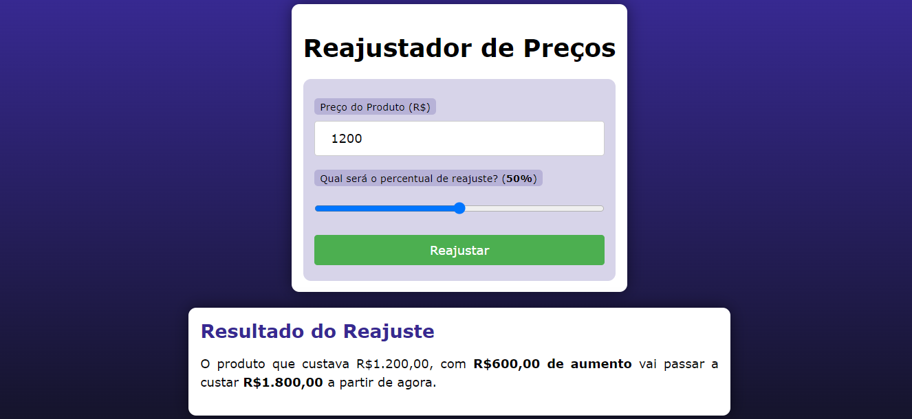

# REAJUSTADOR DE PRECOS
👨‍🏫PROJETO CRIADO PARA O CURSO DE PHP DO CURSO EM VIDEO.

  

## DESCRIÇÃO:
Este aplicativo é um "Reajustador de Preços" que permite calcular o novo preço de um produto após aplicar um percentual de reajuste. O usuário insere o preço atual do produto e o percentual de reajuste desejado, e o aplicativo calcula e exibe o novo preço do produto.

- **Entrada:**
  - Preço do Produto: R$ 100,00
  - Percentual de Reajuste: 20%

- **Saída:**
  - "O produto que custava R\$100,00, com R\$20,00 de aumento vai passar a custar R\$120,00 a partir de agora."

- **Campos Obrigatórios:** Ambos os campos ("Preço do Produto" e "Percentual de Reajuste") são obrigatórios e devem ser preenchidos.
- **Validação:** Certifique-se de inserir valores válidos. O preço deve ser maior que 0,10 e o percentual de reajuste deve estar entre 0% e 100%.
- **Atualização Dinâmica:** O valor do percentual de reajuste é atualizado dinamicamente ao mover o controle deslizante.

## EXECUTANDO O PROJETO:
1. **Executando o Aplicativo:**
   - Coloque os arquivos em um servidor web compatível com PHP (por exemplo, XAMPP, WAMP, LAMP).
   - Acesse o formulário no navegador visitando `http://localhost/CODIGO/index.php`.

2. **Interagir com o Projeto:**
   1. **Abrir a Página Inicial**
      - Ao abrir a página inicial do aplicativo, você verá um formulário com campos para inserir o preço do produto e o percentual de reajuste.

   2. **Inserir o Preço do Produto**
      - No campo "Preço do Produto (R$)", insira o preço atual do produto. O valor deve ser maior que 0,10 e pode conter centavos.

   3. **Definir o Percentual de Reajuste**
      - Use o controle deslizante (slider) para definir o percentual de reajuste. O valor do percentual será exibido ao lado do controle deslizante.

   4. **Enviar o Formulário**
      - Clique no botão "Reajustar" para enviar o formulário. O aplicativo processará os dados e calculará o novo preço do produto.

   5. **Visualizar o Resultado**
      - A página será recarregada e exibirá o resultado abaixo do formulário. O resultado mostrará o aumento em reais e o novo preço do produto.
      
## CREDITOS:
- [PROJETO CRIADO PARA O CURSO DE PHP](https://github.com/VILHALVA/CURSO-DE-PHP)
- [PROJETO FEITO PELO VILHALVA](https://github.com/VILHALVA)

